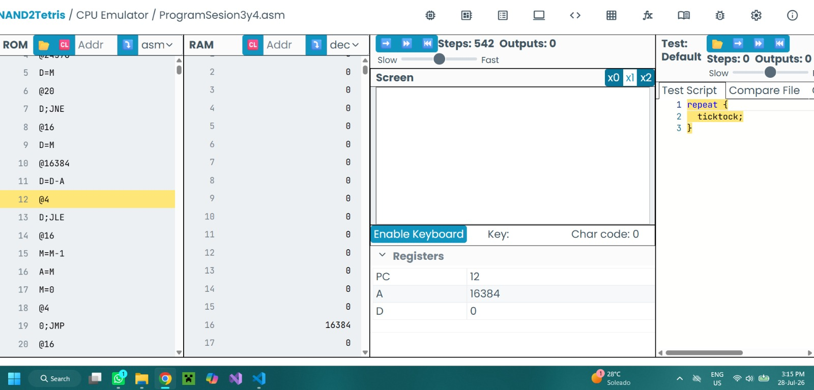
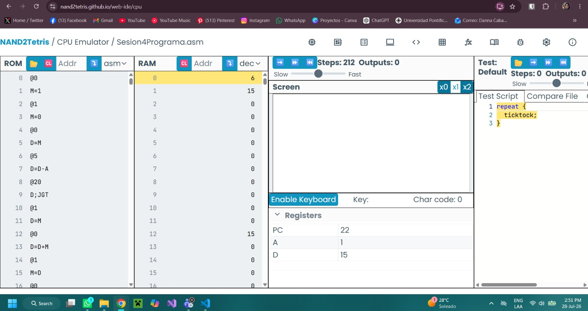
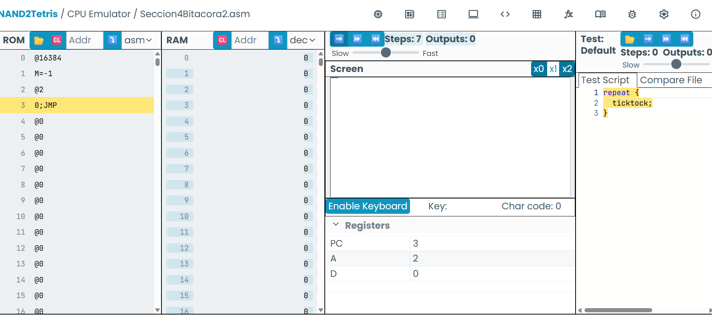
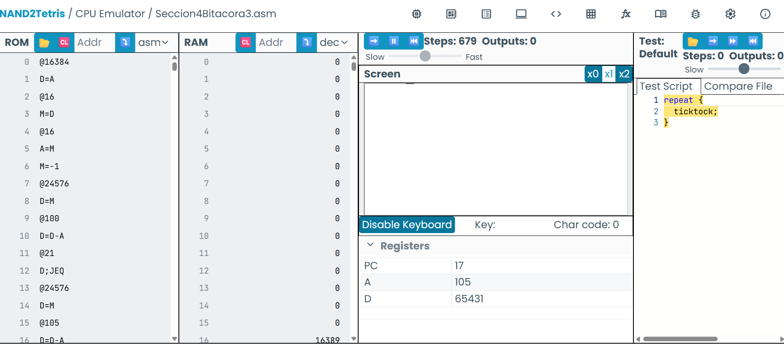
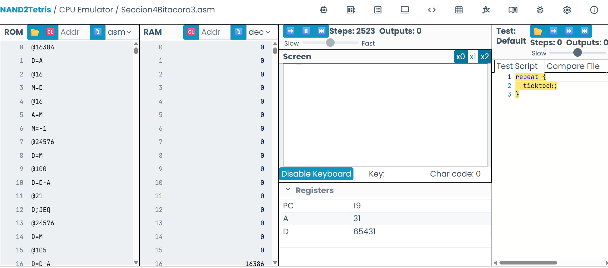

# Para las actividades en la sesión 3, actividad 3, respuesta a las preguntas: 

> Identifica una instrucción que use la ALU y explica qué hace.
 
 
Una instrucción que usa la ALU es D=D-A.
La ALU toma el valor almacenado en el registro "D", le resta el valor del registro "A" y guarda el resultado nuevamente en "D".
Esta operación se utiliza para comprar direcciones.

---

> ¿Para qué sirve el registro PC?

Es el número de la instrucción que la computadora va a ejecutar. Guarda la direccipon de la próxima instrucción que la CPU debe leer y ejecutar desde la memoria ROM.

---

> ¿Cuál es la diferencia entre @i y @READKEYBOARD?

Aunque ambas utilizan la sintaxis de una instrucción A, representan cosas diferentes. @i se refiere a una variable almacenada en la memoria RAM. En este programa, "i" contiene la dirección de la palabra de pantalla que se está pintando o borrando. 
@READKEYBOARD se refiere a una etiqueta del programa almacenado en la ROM. Esta etiqueta marca la dirección donde comienza la parte del programa que lee el teclado:(READKEYBOARD)

---

> Describe qué se necesita para leer el teclado y mostrar información en la pantalla.

Para leer el teclado se utiliza la dirección especial KBD, que corresponde a una posición de memoria mapeada:
@KBD
D=M
Estas instrucciones guardan en D el valor del teclado.
Si D = 0, no hay ninguna tecla presionada.
Si D ≠ 0, hay una tecla presionada y el valor representa su código.
Para mostrar información en la pantalla se utiliza la memoria que comienza en la dirección SCREEN.
Por ejemplo:
@SCREEN
M=-1
Esto escribe -1 en la primera palabra de la pantalla. Como -1 en binario está compuesto por 16 unos, se pintan 16 píxeles negros.
Para borrar esos píxeles se puede escribir:
@SCREEN
M=0
Cada palabra de la memoria de pantalla controla 16 píxeles:
Bit en 1: píxel negro.
Bit en 0: píxel blanco.

---

> Identifica un bucle en el programa y explica su funcionamiento.

El bucle principal del programa se forma con la etiqueta: (READKEYBOARD) y el salto 0;JMP. Esta última es un salto incondicional, es decir, siempre se ejecuta. Cuando el programa llega a este salto, vuelve a READKEYBOARD y lee nuevamente el estado del teclado. Este proceso se repite indefinidamente miesntras el programa esté en ejecución. 

---

> Identifica una condición en el programa y explica su funcionamiento.

@KEYPRESSED
D;JNE
Antes de esta instrucción, D contiene el valor del teclado.
Si D es diferente de 0, hay una tecla presionada y el programa salta a KEYPRESSED.
Si D es 0, no hay una tecla presionada y el programa continúa por la sección que borra la pantalla.

---

- Registro de captura:

---

# Actividad 4 de la sección 3. 

 Captura de pantalla del funcionamiento: 

---

# Para las actividades de la sección 4, se adjuntan capturas del funcionamiento de cada programa.

> 1- Crea un programa que use un ciclo para sumar los números del 1 al 5 y guarde el resultado en la dirección de memoria 12.

> 2- Escribe un programa que dibuje un punto negro en la esquina superior izquierda de la pantalla.

> 3- Modifica el programa anterior para que dibuje una línea horizontal negra de 16 pixeles de largo en la esquina superior izquierda de la pantalla. (Recuerda que cada word en la memoria representa 16 pixeles).

> 4- Modifica el programa de la actividad anterior de tal manera que puedas mover la línea horizontal de derecha a izquierda usando las teclas d e i respectivamente. Tu programa no tiene que verificar si la línea se sale de la pantalla.

